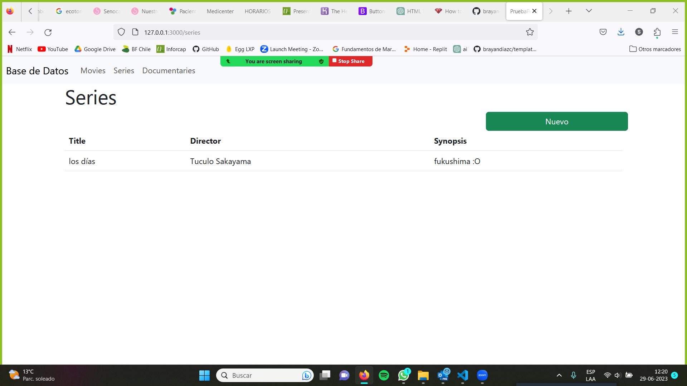

# PruebaPeliculas

PruebaPeliculas es una aplicación desarrollada para un Desafío Evaluado de Bootcamp en Ruby on Rails para gestionar películas, series y documentales.

## Características

- Permite ver una lista de películas, series y documentales.
- Permite agregar nuevas películas, series y documentales.
- Utiliza un poco de Bootstrap, para una interfaz más atractiva y receptiva.

## Requisitos previos

- Ruby 3.2.2
- Rails 7.0.5.1
- PostgreSQL (u otro sistema de gestión de bases de datos compatible)

## Instalación

1. Clona este repositorio en tu máquina local: git clone https://github.com/tu_usuario/prueba_peliculas.git

2. Accede al directorio del proyecto:
cd prueba_peliculas

3. Instala las dependencias de Ruby:
bundle install
csharp

4. Crea y configura la base de datos:
rails db:create
rails db:migrate

5. Inicia el servidor de desarrollo:
rails server

6. Accede a la aplicación en tu navegador web en [http://localhost:3000](http://localhost:3000).

## Contribuir

Si deseas contribuir a PruebaPeliculas, puedes seguir los pasos a continuación:

1. Crea una bifurcación (fork) de este repositorio.
2. Crea una rama (branch) para tu nueva funcionalidad o solución de problema: `git checkout -b nueva-funcionalidad`.
3. Realiza los cambios necesarios y realiza confirmaciones (commits) descriptivos.
4. Envía tus cambios a tu repositorio remoto: `git push origin nueva-funcionalidad`.
5. Abre una solicitud de extracción (pull request) en este repositorio, describiendo tus cambios en detalle.

## Licencia

Este proyecto está licenciado bajo la [Licencia MIT](https://opensource.org/licenses/MIT).

## Autor ✒️

    Sandra Campos Galeas - Trabajo inicial 

## Expresiones de Gratitud 🎁

Estamos agradecidos por las contribuciones de la comunidad a este proyecto. Si encontraste cualquier valor en este proyecto o quieres contribuir, aquí está lo que puedes hacer:

    Comparte este proyecto con otros
    Invítanos un café ☕
    Inicia un nuevo problema o contribuye con un PR
    Muestra tu agradecimiento diciendo gracias en un nuevo problema.
